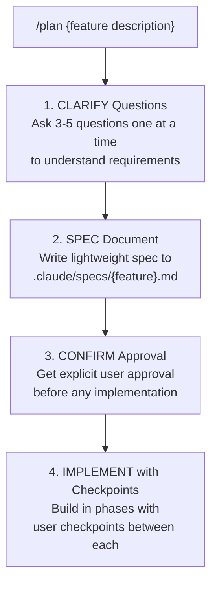

# Claude Spec-Driven Development

A lightweight framework for spec-driven development with Claude Code. Define requirements clearly, get explicit confirmation, then implement with checkpoints.

## Why Spec-Driven?

When working with AI assistants on non-trivial features, jumping straight to code often leads to:
- Misunderstood requirements
- Wasted implementation effort
- Features that miss the mark

This framework adds a **specification phase** before implementation, ensuring alignment between what you want and what gets built.

## How It Works



## Installation

### Using the CLI Tool (Recommended)

Install via Go:

```bash
go install github.com/heiko-braun/claude-spec-driven/cmd/claudespec@latest
```

Or download pre-built binaries from the [releases page](https://github.com/heiko-braun/claude-spec-driven/releases):

**macOS (Intel):**
```bash
curl -L https://github.com/heiko-braun/claude-spec-driven/releases/latest/download/claudespec-darwin-amd64 -o claudespec
chmod +x claudespec
sudo mv claudespec /usr/local/bin/
```

**macOS (Apple Silicon):**
```bash
curl -L https://github.com/heiko-braun/claude-spec-driven/releases/latest/download/claudespec-darwin-arm64 -o claudespec
chmod +x claudespec
sudo mv claudespec /usr/local/bin/
```

Then bootstrap your project:

```bash
cd /path/to/your/project
claudespec init
```

### Manual Installation

Copy the `.claude/` directory to your project:

```bash
cp -r .claude/ /path/to/your/project/
```

## Usage

### CLI Tool

The `claudespec` CLI helps you bootstrap the spec-driven workflow into any repository:

```bash
# Initialize in current directory
claudespec init

# Initialize in specific directory
claudespec init /path/to/project

# Overwrite existing files
claudespec init --force

# Check version
claudespec --version
```

If files already exist, the CLI will warn you and exit. Use `--force` to overwrite them.

### Start a Feature

```
/plan Add user authentication with OAuth support
```

Claude will:
1. Ask clarifying questions one at a time
2. Draft a spec based on your answers
3. Ask for confirmation before implementing

### Spec Format

Specs are stored in `.claude/specs/` with this structure:

```markdown
# Feature: {name}

## Goal
{What this accomplishes and why}

## Acceptance Criteria
- [ ] {Testable criterion 1}
- [ ] {Testable criterion 2}

## Approach
{2-3 sentences on implementation strategy}

## Out of Scope
- {Explicit exclusion 1}
- {Explicit exclusion 2}
```

### Implementation Phases

After spec approval, implementation proceeds in phases:

1. **Foundation** - Data models, types, schemas
2. **Core Logic** - Business logic, algorithms
3. **Integration** - Wire up components
4. **Polish** - Error handling, edge cases
5. **Verification** - Check acceptance criteria

After each phase, Claude pauses for your approval before continuing.

## Project Structure

```
.claude/
├── commands/
│   ├── plan.md                    # Entry point for /plan command
│   ├── spec.md                    # Specification creation
│   ├── refine.md                  # Refine existing specs
│   └── implement.md               # Implementation with checkpoints
└── specs/
    ├── TEMPLATE.md                # Spec template reference
    └── {feature}.md               # Generated specs
```

## Commands Reference

### `/plan` Command

Entry point for spec-driven development. Asks clarifying questions, creates a spec, then implements after approval.

### `/spec` Command

- Asks 3-5 clarifying questions (one at a time)
- Creates spec in `.claude/specs/{feature}.md`
- Requires explicit confirmation before proceeding

**When to use:**
- Features involving multiple files
- Architectural decisions
- User-facing changes
- External integrations

**When to skip:**
- Simple bug fixes
- Single-line changes
- Documentation updates

### `/refine` Command

- Loads existing spec from `.claude/specs/`
- Asks 2-3 focused refinement questions
- Updates spec in place while preserving progress
- Shows diff summary of changes
- Documents refinements with timestamps in Notes section

**When to use:**
- Spec needs updates based on feedback
- Requirements have changed slightly
- Implementation revealed new edge cases
- Need to adjust approach or criteria

**When to create new spec:**
- Major scope changes
- Completely different approach needed
- New feature that builds on existing one

### `/implement` Command

- Loads confirmed spec from `.claude/specs/`
- Breaks work into phases using TodoWrite
- Implements with checkpoint pauses
- Verifies against acceptance criteria
- Updates spec with completion status

## Benefits

- **Alignment**: Ensure you and Claude agree on what's being built
- **Control**: Pause points let you review, adjust, or stop
- **Documentation**: Specs serve as lightweight feature docs
- **Resumability**: Interrupted work can be continued from where you left off

## License

Apache 2.0
