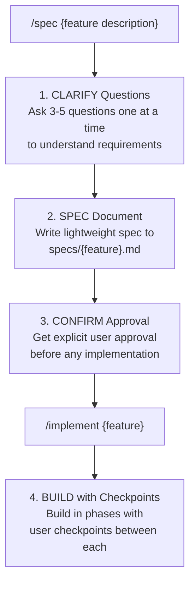

# Draft

**Draft your specs before you code** - a specification-driven development workflow for AI assistants.

A lightweight framework for spec-driven development with Claude Code and other AI coding assistants. Define requirements clearly, get explicit confirmation, then implement with checkpoints.

## Why Spec-Driven?

When working with AI assistants on non-trivial features, jumping straight to code often leads to:
- Misunderstood requirements
- Wasted implementation effort
- Features that miss the mark

This framework adds a **specification phase** before implementation, ensuring alignment between what you want and what gets built.

## How It Works



## Installation

### Using the CLI Tool (Recommended)

Install via Go:

```bash
go install github.com/heiko-braun/draft/cmd/draft@latest
```

Or download pre-built binaries from the [releases page](https://github.com/heiko-braun/draft/releases):

**macOS (Intel):**
```bash
curl -L https://github.com/heiko-braun/draft/releases/latest/download/draft-darwin-amd64 -o draft
chmod +x draft
sudo mv draft /usr/local/bin/
```

**macOS (Apple Silicon):**
```bash
curl -L https://github.com/heiko-braun/draft/releases/latest/download/draft-darwin-arm64 -o draft
chmod +x draft
sudo mv draft /usr/local/bin/
```

Then bootstrap your project:

```bash
cd /path/to/your/project
draft init

# Initialize for Claude only
draft init --agent claude

# Initialize for Cursor only
draft init --agent cursor

# Initialize for both (default)
draft init
```

### Manual Installation

Copy the `.claude/` directory to your project:

```bash
cp -r .claude/ /path/to/your/project/
```

## Usage

### CLI Tool

The `draft` CLI helps you bootstrap the spec-driven workflow into any repository:

```bash
# Initialize for both Claude and Cursor (default)
draft init

# Initialize for Claude Code only
draft init --agent claude

# Initialize for Cursor only
draft init --agent cursor

# Initialize in specific directory
draft init /path/to/project

# Overwrite existing files
draft init --force

# Check version
draft --version
```

The `--agent` flag determines which AI coding assistant format to use:
- **`--agent claude`**: Creates `.claude/commands/` with Claude Code slash commands
- **`--agent cursor`**: Creates `.cursor/skills/` with Cursor-compatible skills
- **No flag**: Creates both formats (default)

If files already exist, the CLI will warn you and exit. Use `--force` to overwrite them.

### Start a Feature

```
/spec Add user authentication with OAuth support
```

Claude will:
1. Ask clarifying questions one at a time
2. Create a spec in `specs/` based on your answers
3. Ask for confirmation

Once confirmed, implement it:

```
/implement authentication
```

This loads the spec and builds in phases with checkpoints between each.

### Spec Format

Specs are stored in `/specs/` with this structure:

```markdown
# Feature: {name}

## Goal
{What this accomplishes and why}

## Acceptance Criteria
- [ ] {Testable criterion 1}
- [ ] {Testable criterion 2}

## Approach
{2-3 sentences on implementation strategy}

## Out of Scope
- {Explicit exclusion 1}
- {Explicit exclusion 2}
```

### Implementation Phases

After spec approval, implementation proceeds in phases:

1. **Foundation** - Data models, types, schemas
2. **Core Logic** - Business logic, algorithms
3. **Integration** - Wire up components
4. **Polish** - Error handling, edge cases
5. **Verification** - Check acceptance criteria

After each phase, Claude pauses for your approval before continuing.

## Project Structure

```
.claude/                           # Claude Code workflow commands (SOURCE OF TRUTH)
├── commands/
│   ├── spec.md                    # Specification creation
│   ├── implement.md               # Implementation with checkpoints
│   └── refine.md                  # Refine existing specs

.cursor/                           # Cursor workflow skills (SOURCE OF TRUTH)
├── skills/
│   ├── spec/SKILL.md              # Specification creation
│   ├── implement/SKILL.md         # Implementation with checkpoints
│   └── refine/SKILL.md            # Refine existing specs

specs/                             # Project specifications (SOURCE OF TRUTH)
├── TEMPLATE.md                    # Spec template reference
└── {feature}.md                   # Generated specs

cmd/draft/templates/               # Build artifacts (git-ignored, auto-synced)
├── .claude/
├── .cursor/
└── specs/
```

**Note:** The `.claude/`, `.cursor/`, and `specs/` directories at the project root are the source of truth. Files in `cmd/draft/templates/` are automatically synced during builds and should never be edited directly.

## Commands Reference

### `/spec` Command

Creates a specification through a question-driven process.

**Process:**
1. Asks 3-5 clarifying questions (one at a time)
2. Creates spec in `/specs/{feature}.md`
3. Presents spec for your review and confirmation

**Use when:**
- Features involving multiple files or architectural decisions
- User-facing changes or external integrations
- Non-trivial features that benefit from planning

**Skip when:**
- Simple bug fixes with obvious solutions
- Single-line changes or documentation updates

### `/implement` Command

Implements a feature from an existing specification with phased checkpoints.

**Process:**
1. Loads spec from `/specs/{feature}.md`
2. Breaks work into logical phases (foundation, core logic, integration, polish, verification)
3. After each phase, pauses for your approval before continuing
4. Verifies against acceptance criteria when complete
5. Updates spec to mark completed criteria

**Use when:**
- A spec has been created and confirmed with `/spec`
- Resuming interrupted implementation
- User explicitly says "implement {feature}"

### `/refine` Command

Updates an existing specification while preserving progress.

**Process:**
1. Loads existing spec from `/specs/`
2. Asks 2-3 focused refinement questions
3. Updates spec in place (preserves completed checkboxes)
4. Shows diff summary and asks for confirmation
5. Documents changes with timestamp in Notes section

**Use when:**
- Spec needs updates based on feedback
- Requirements have changed slightly
- Implementation revealed new edge cases

**Create new spec instead when:**
- Scope is expanding significantly
- Core goals have completely changed

## Benefits

- **Alignment**: Ensure you and Claude agree on what's being built
- **Control**: Pause points let you review, adjust, or stop
- **Documentation**: Specs serve as lightweight feature docs
- **Resumability**: Interrupted work can be continued from where you left off

## Development

### Building from Source

```bash
# Clone the repository
git clone https://github.com/heiko-braun/draft.git
cd draft

# Build (automatically syncs templates from .claude/)
make build

# Or build and install
make install
```

The build process automatically syncs templates from `.claude/` and `.cursor/` (source of truth) to `cmd/draft/templates/` (embed location) before building the binary.

### Template Source of Truth

- **Edit templates in**: `.claude/commands/*.md`, `.cursor/skills/*/SKILL.md`, and `specs/TEMPLATE.md`
- **Never edit**: `cmd/draft/templates/` (auto-generated build artifacts)
- **Manual sync**: `make sync-templates` (automatic when running `make build` or `make install`)

## License

Apache 2.0
